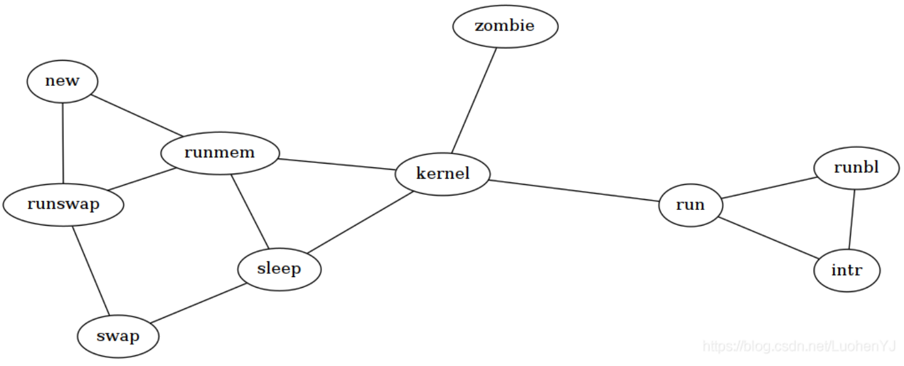

# python模块graphviz使用入门

## 1 安装

该软件包在Python 2.7和3.5+下运行，请使用pip进行安装：

> pip install graphviz

要渲染生成的可在Graphviz软件使用DOT源代码，您还需要安装Graphviz(下载页面)，并确保包含dot可执行文件的目录在系统路径上。

## 2 快速入门

### 2.1 基本用法

该graphviz模块提供了两个类：Graph和 Digraph。它们分别以DOT语言为无向图和有向图创建图描述。它们具有相同的 API。通过实例化一个new Graph或 Digraphobject 创建一个图形：

```python
from graphviz import Digraph
dot = Digraph(comment='The Round Table')
print(dot)
```

输出如下信息:

```shell
// The Round Table
digraph {
}
```

然后我们可以添加点和边，通过node()和edge()或edges()来实现。

```python
from graphviz import Digraph

dot = Digraph(comment='The Round Table')
dot.node('A', 'King Arthur')
dot.node('B', 'Sir Bedevere the Wise')
dot.node('L', 'Sir Lancelot the Brave')

dot.edges(['AB', 'AL'])
dot.edge('B', 'L', constraint='false')
print(dot.source)  

```

生成的源代码如下：

```shell
// The Round Table
digraph {
    A [label="King Arthur"]
    B [label="Sir Bedevere the Wise"]
    L [label="Sir Lancelot the Brave"]
    A -> B
    A -> L
    B -> L [constraint=false]
}

```

最后我们可以通过如下代码保存图像pdf文件，并显示。通过设置view=True将自动使用系统默认的文件类型的查看器应用程序打开生成的文件（PDF，PNG，SVG等）。

```python
dot.render('test-output/round-table.gv', view=True) 
```


### 2.2 输出图像格式

要使用与默认PDF 不同的输出文件格式，请format在创建Graph或 Digraph对象时使用参数：

```python
from graphviz import Graph
g = Graph(format='png')
#或者在基本用法的例子中在输出中添加format='jpg’便可以获得jpg图像。
#dot.render('test-output/round-table.gv',format='jpg', view=True)  
```

如果是想设置输出图像的dpi，需要在创建Graph或Digraph对象时，设置dpi参数。

```python
from graphviz import Graph

g = Graph(format='png')
g.graph_attr['dpi'] = '300'

```

### 2.3 图像style设置

使用graph_attr，node_attr和 edge_attr参数更改默认外观的图表，点和连接线。

```python
from graphviz import Digraph

ps = Digraph(name='pet-shop', node_attr={'shape': 'plaintext'},format='png')
ps.node('parrot')
ps.node('dead')
ps.edge('parrot', 'dead')

```


### 2.4 属性

要设置图中的所有后续图形，点或边的树形，请使用attr()方法，如下所示：

```python
from graphviz import Digraph
from graphviz import Graph
ni = Graph('ni',format='jpg')

ni.attr('node', shape='rarrow')
ni.node('1', 'Ni!')
ni.node('2', 'Ni!')

ni.node('3', 'Ni!', shape='egg')

ni.attr('node', shape='star')
ni.node('4', 'Ni!')
ni.node('5', 'Ni!')
ni.attr(rankdir='LR')

ni.edges(['12', '23', '34', '45'])
print(ni.source) 
ni.view()

```


2.5 子图和聚类
图和有向图对象有一个subgraph（）-用于向实例添加子图的方法。
有两种方法可以使用它：使用与唯一参数（其内容作为子图添加）类型相同的现成图形对象，或者省略图形参数（返回上下文管理器，以便在with块中更优雅地定义子图内容）。
第一个用法选项，只有graph作为参数：

```python
from graphviz import Digraph
from graphviz import Graph
p = Graph(name='parent', node_attr={'shape': 'plaintext'},format='png')
p.edge('spam', 'eggs')

c = Graph(name='child', node_attr={'shape': 'box'})
c.edge('foo', 'bar')

p.subgraph(c)
p.view()

```

第二次使用，带有with-block（忽略graph参数）：

```python
p = Graph(name='parent')
p.edge('spam', 'eggs')

with p.subgraph(name='child', node_attr={'shape': 'box'}) as c:
    c.edge('foo', 'bar')

```

两者结果相同如下图所示:


## 3 实例

### 3.1有向图

```python
from graphviz import Digraph

g = Digraph('G', filename='hello.gv',format='png')

g.edge('Hello', 'World')

g.view()

```


### 3.2无向图

```python
from graphviz import Graph

g = Graph('G', filename='process.gv', engine='sfdp',format='png')

g.edge('run', 'intr')
g.edge('intr', 'runbl')
g.edge('runbl', 'run')
g.edge('run', 'kernel')
g.edge('kernel', 'zombie')
g.edge('kernel', 'sleep')
g.edge('kernel', 'runmem')
g.edge('sleep', 'swap')
g.edge('swap', 'runswap')
g.edge('runswap', 'new')
g.edge('runswap', 'runmem')
g.edge('new', 'runmem')
g.edge('sleep', 'runmem')

g.view()

```



### 3.3子图

```python

from graphviz import Digraph

g = Digraph('G', filename='cluster.gv',format='png')

# NOTE: the subgraph name needs to begin with 'cluster' (all lowercase)
#       so that Graphviz recognizes it as a special cluster subgraph

with g.subgraph(name='cluster_0') as c:
    c.attr(style='filled', color='lightgrey')
    c.node_attr.update(style='filled', color='white')
    c.edges([('a0', 'a1'), ('a1', 'a2'), ('a2', 'a3')])
    c.attr(label='process #1')

with g.subgraph(name='cluster_1') as c:
    c.attr(color='blue')
    c.node_attr['style'] = 'filled'
    c.edges([('b0', 'b1'), ('b1', 'b2'), ('b2', 'b3')])
    c.attr(label='process #2')

g.edge('start', 'a0')
g.edge('start', 'b0')
g.edge('a1', 'b3')
g.edge('b2', 'a3')
g.edge('a3', 'a0')
g.edge('a3', 'end')
g.edge('b3', 'end')

g.node('start', shape='Mdiamond')
g.node('end', shape='Msquare')

g.view()

```


### 3.4 自定义 node 样式-fsm

```python
from graphviz import Digraph
f = Digraph('finite_state_machine', filename='fsm.gv')
f.attr(rankdir='LR', size='20,5')
# 单独定义的 node 会有双圆结构
f.attr('node', shape='doublecircle')
f.node('LR_0')
f.node('LR_3')
f.node('LR_4')
f.node('LR_8')
f.attr('node', shape='circle')
f.edge('LR_0', 'LR_2', label='SS(B)')
f.edge('LR_0', 'LR_1', label='SS(S)')
f.edge('LR_1', 'LR_3', label='S($end)')
f.edge('LR_2', 'LR_6', label='SS(b)')
f.edge('LR_2', 'LR_5', label='SS(a)')
f.edge('LR_2', 'LR_4', label='S(A)')
f.edge('LR_5', 'LR_7', label='S(b)')
f.edge('LR_5', 'LR_5', label='S(a)')
f.edge('LR_6', 'LR_6', label='S(b)')
f.edge('LR_6', 'LR_5', label='S(a)')
f.edge('LR_7', 'LR_8', label='S(b)')
f.edge('LR_7', 'LR_5', label='S(a)')
f.edge('LR_8', 'LR_6', label='S(b)')
f.edge('LR_8', 'LR_5', label='S(a)')
f.view()
```

最终的结果如下所示，可以看到上面单独定义的，LR_0、LR_3、LR_4、LR_8 都是两个圆：


### 3.5 使用类 html 标签

```python
from graphviz import Digraph
s = Digraph('structs', filename='structs_revisited.gv',
            node_attr={'shape': 'record'})
s.node('struct1', '<f0> left|<f1> middle|<f2> right')
s.node('struct2', '<f0> one|<f1> two')
s.node('struct3', r'hello\nworld |{ b |{c|<here> d|e}| f}| g | h')
s.edges([('struct1:f1', 'struct2:f0'), ('struct1:f2', 'struct3:here')])
s.view()
```

最终的结果如下所示，上面的 f0 等其实都是 label，连线的时候会根据这些 label 进行连线。


我们把上面的 f0 等都去掉，做一些变化：

```python
from graphviz import Digraph
s = Digraph('structs', filename='structs_revisited.gv',
            node_attr={'shape': 'record'})
s.node('struct1', 'left| middle| right')
s.node('struct2', '{a|{b1|b2|b3}|c}')
s.node('struct3', r'hello\nworld |{ b |{c|d|e}| f}| g | h')
s.edges([('struct1', 'struct2'), ('struct1', 'struct3')])
s.view()
```

可以得到下面的图，有横向和纵向的分割：


### 3.6 绘制树结构

```python
from graphviz import Digraph, nohtml
g = Digraph('g', filename='btree.gv',
            node_attr={'shape': 'record', 'height': '.1'})
g.node('node0', nohtml('<f0> |<f1> G|<f2>'))
g.node('node1', nohtml('<f0> |<f1> E|<f2>'))
g.node('node2', nohtml('<f0> |<f1> B|<f2>'))
g.node('node3', nohtml('<f0> |<f1> F|<f2>'))
g.node('node4', nohtml('<f0> |<f1> R|<f2>'))
g.node('node5', nohtml('<f0> |<f1> H|<f2>'))
g.node('node6', nohtml('<f0> |<f1> Y|<f2>'))
g.node('node7', nohtml('<f0> |<f1> A|<f2>'))
g.node('node8', nohtml('<f0> |<f1> C|<f2>'))
g.edge('node0:f2', 'node4:f1')
g.edge('node0:f0', 'node1:f1')
g.edge('node1:f0', 'node2:f1')
g.edge('node1:f2', 'node3:f1')
g.edge('node2:f2', 'node8:f1')
g.edge('node2:f0', 'node7:f1')
g.edge('node4:f2', 'node6:f1')
g.edge('node4:f0', 'node5:f1')
g.view()
```


## --
